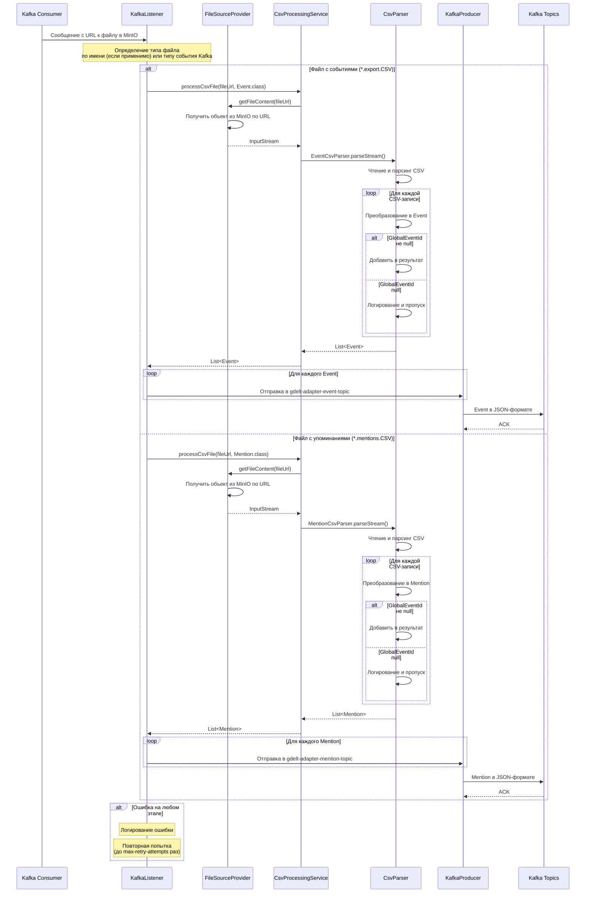

# Сервис преобразования данных (em-adapter)

Микросервис `em-adapter` отвечает за получение путей к CSV-файлам из Kafka, их обработку, преобразование в объекты доменной модели и отправку этих объектов в соответствующие топики Kafka для дальнейшей обработки em-processor.

## Основной рабочий процесс

1. **Получение пути к файлу из Kafka:**
   * Сервис слушает топики Kafka (`gdelt-collector-event-topic` и `gdelt-collector-mention-topic`), которые содержат URL к CSV-файлам в MinIO хранилище в формате строки.
   * Архитектура сервиса использует `MinioFileSourceProvider` для получения файлов из MinIO по предоставленному URL.

2. **Доступ к файлу:**
   * Сервис использует реализацию `MinioFileSourceProvider` для доступа к файлам в MinIO хранилище по URL, полученному из Kafka.

3. **Парсинг CSV-файла:**
    * `CsvProcessingService` получает содержимое файла через `FileSourceProvider` и передает поток данных соответствующему парсеру.
    * В зависимости от типа файла (определяемого по имени) используется один из специализированных парсеров:
        * `EventCsvParser` - для файлов GDELT с событиями (`*.translation.export.CSV`)
        * `MentionCsvParser` - для файлов GDELT с упоминаниями (`*.translation.mentions.CSV`)
    * Парсеры используют библиотеку Apache Commons CSV для потоковой обработки CSV-файлов, что позволяет эффективно обрабатывать файлы большого размера.

4. **Преобразование и валидация данных:**
    * CSV-записи преобразуются в соответствующие объекты (`Event` или `Mention`).
    * Выполняется базовая валидация данных — проверяется наличие ключевых полей (например, `GlobalEventId`).
    * Невалидные записи логируются и пропускаются, но процесс обработки продолжается.

5. **Отправка в Kafka:**
    * Преобразованные объекты сериализуются в JSON и отправляются в соответствующие исходящие топики Kafka:
        * События (`Event`) => `gdelt-adapter-event-topic`
        * Упоминания (`Mention`) => `gdelt-adapter-mention-topic`
    * Для надежной доставки используется настройка `acks=all` и механизм идемпотентности.

## Расширяемость

* **Абстракция источника файлов:** Интерфейс `FileSourceProvider` позволяет легко добавить новые источники данных помимо MinIO.
* **Абстракция парсеров:** Интерфейс `CsvParser<T>` обеспечивает единообразную обработку различных типов CSV-файлов.
* **Масштабируемость:** Потоковая обработка CSV и пакетная отправка в Kafka позволяют эффективно обрабатывать большие объемы данных.

## Диаграмма последовательности (клик на кнопку ⟷ развернет схему)

